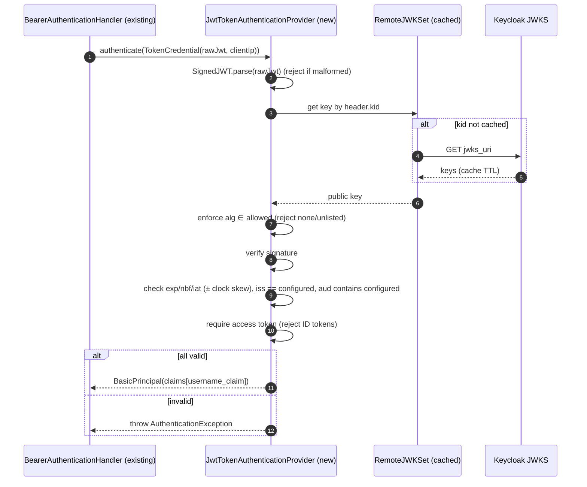
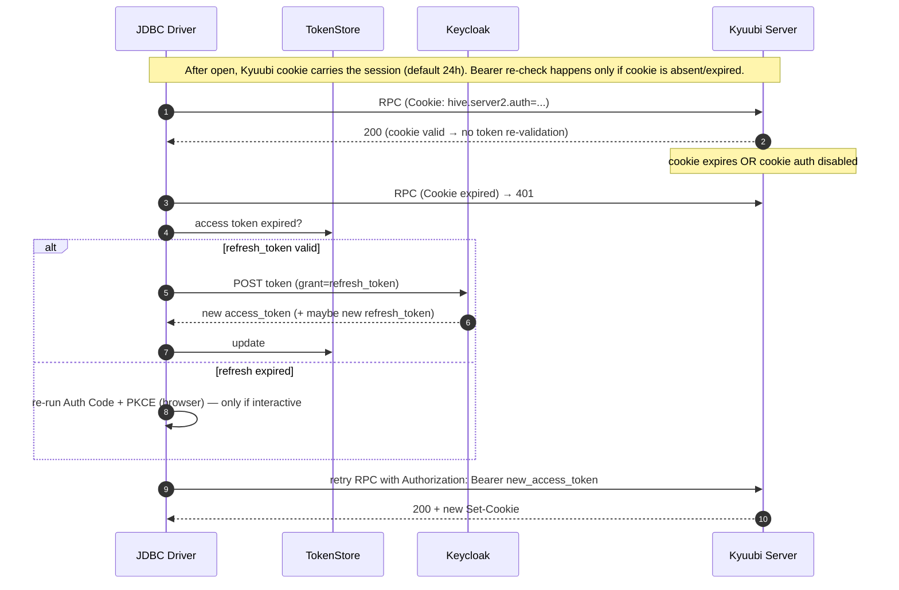
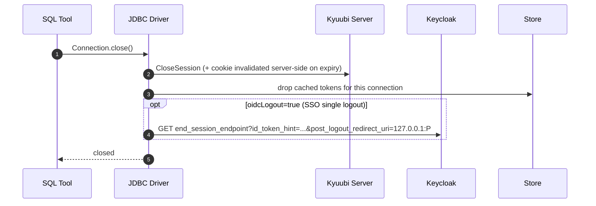

# OIDC / Keycloak SSO for Apache Kyuubi 1.10.3 — Feasibility Analysis & Architecture Design

> Status: **Feasibility + design review deliverable — Revision 2.** Implementation is intentionally
> NOT started yet (per the task brief: "Do not begin implementation until the feasibility analysis and
> architecture review are complete"). Section 12 contains the phased implementation plan to be
> approved before any code is written.
>
> Revision 2 incorporates the review comments (`comment.md`): desktop-vs-headless applicability (§1.1),
> THRIFT_HTTP framed as an implementation choice not a limitation (§2.3), relaxed driver-API framing
> (§6.2) and relaxed "no core changes" language → "minimize changes" (§1/§4/§5/§12), Nimbus
> *recommended* not mandated (§8), extended JWT validation (`iat` + algorithm allow-list, reject
> `alg=none`) (§8/§10), **access tokens only / reject ID tokens** (§8/§10), audience always
> configurable and never realm-derived (§6.1/§8/§10), **prefer OIDC Discovery** (§6.1/§8), refresh-token
> clarification (§9), and explicit preservation of the existing `auth=jwt` mode (§11).

---

## 1. Executive summary

**Verdict: feasible, with minimal changes to existing Kyuubi components** — and *not* by implementing
an `AuthenticationProvider` alone. Browser-based SSO is inherently a **client-side, interactive**
flow. The work splits into two additive pieces:

| Side | What is needed | Invasiveness to existing components |
|------|----------------|--------------------|
| **Kyuubi Server** | A `TokenAuthenticationProvider` that validates a Keycloak **access-token** JWT (JWKS signature + issuer/audience/expiry), wired through the **already-existing** HTTP Bearer extension point (`kyuubi.authentication.custom.bearer.class`). | Minimal — plugs into an existing SPI + handler; can ship as a drop-in JAR. |
| **JDBC Driver** | A backward-compatible OIDC option that runs OAuth2 Authorization Code + PKCE (browser + loopback callback → code→token) — or Device Flow for headless — then carries the access token through the **already-existing** `Authorization: Bearer` interceptor. | Minimal — reuses the existing HTTP/JWT transmit path; the exact URL syntax is an open API choice (§6.2). |

Both pieces reuse machinery already shipping in 1.10.3 and are **provider-independent** (Keycloak
first, any standard OIDC provider after). The guiding rule is *reuse over rewrite*: the server piece
can be a **drop-in plugin JAR**, and small, well-justified changes to existing modules are acceptable
where they improve integration or maintainability (§4, §12). The driver piece needs **no new
third-party dependency** (JDK-only: `Desktop`, `com.sun.net.httpserver.HttpServer`,
`HttpURLConnection`, `MessageDigest`).

The single most important realization: **the Authentication SPI cannot initiate a browser redirect.**
The server never has a channel to the user's browser. The SPI only covers the *final* step —
validating a token that the client has already obtained. Everything before that (browser, login,
code exchange) must happen in the driver.

### 1.1 Client applicability — desktop vs headless

Browser-based SSO applies **only to interactive desktop clients** that can open a browser:

- **Desktop (browser SSO):** DBeaver, DataGrip, IntelliJ Database Tools, and similar GUI JDBC tools.
- **Headless (no browser):** Beeline, Sqlline, Spark, Airflow, and server-side applications **cannot**
  rely on browser-based authentication. For these, use either **OAuth2 Device Authorization Flow
  (RFC 8628)** or a **pre-issued access token** via the existing `auth=jwt` mode. The driver detects
  the absence of a browser/loopback and never attempts an auth-code launch in those environments.

### 1.2 Design principles (held throughout)

- Reuse the existing Kyuubi **Authentication SPI** (`TokenAuthenticationProvider`) wherever possible.
- Reuse the existing **HTTP Bearer** authentication path.
- **Minimize invasive changes** to Kyuubi core; small improvements to existing modules are allowed.
- Keep the implementation **provider-independent** (not Keycloak-specific).
- Maintain **full backward compatibility**, including the existing `auth=jwt` mode (§11).

---

## 2. Current-state findings (grounded in the 1.10.3 source)

### 2.1 Server-side authentication SPI

Two provider traits in `kyuubi-common/.../service/authentication/`:

- `PasswdAuthenticationProvider.authenticate(user: String, password: String): Unit` — backs SASL
  PLAIN (binary) and HTTP Basic. (`PasswdAuthenticationProvider.scala:36`)
- `TokenAuthenticationProvider.authenticate(credential: TokenCredential): Principal` — backs HTTP
  **Bearer**. Returns a `java.security.Principal` whose `getName` becomes the session username.
  (`TokenAuthenticationProvider.scala:36`, `Credential.scala:20-28`)

`kyuubi.authentication` accepts a comma-separated list of `NOSASL, NONE, LDAP, JDBC, KERBEROS,
CUSTOM` (`AuthTypes.scala:23`, `KyuubiConf.scala:864-902`). Custom providers are loaded reflectively
via a `(KyuubiConf)` or no-arg constructor (`ClassUtils.createInstance`,
`AuthenticationProviderFactory.scala:44-89`).

Relevant config keys (all `.serverOnly`, added in **1.10.0**):

- `kyuubi.authentication.custom.class` → `PasswdAuthenticationProvider` (basic/PLAIN)
- `kyuubi.authentication.custom.basic.class` → HTTP Basic (falls back to `custom.class`)
- `kyuubi.authentication.custom.bearer.class` → **`TokenAuthenticationProvider`** (HTTP Bearer) ← this is our server hook

### 2.2 HTTP Bearer path (the token channel)

`ThriftHttpServlet` reads the `Authorization` header and dispatches by scheme
(`ThriftHttpServlet.scala:278-284`). `AuthenticationFilter.initAuthHandlers()` registers a
`BearerAuthenticationHandler` **only when the effective plain auth type is `CUSTOM`** and
`custom.bearer.class` is set (`AuthenticationFilter.scala:71-85`). The handler passes the raw token
string (everything after `Bearer `) to the configured provider
(`BearerAuthenticationHandler.scala:70-87`):

```scala
val credential = DefaultTokenCredential(inputToken, HttpAuthUtils.getCredentialExtraInfo)
principal = AuthenticationProviderFactory
  .getHttpBearerAuthenticationProvider(providerClass, conf)
  .authenticate(credential).getName
```

**Kyuubi performs no JWT validation itself.** The shipped `TokenAuthenticationProvider`
implementations are `AnonymousAuthenticationProviderImpl` (no-op) and a test-only stub. There is **no
JWT parser, no JWKS client, no issuer/audience/exp checking, and `nimbus-jose-jwt`/`jose4j`/`jjwt`
are NOT on the classpath** (confirmed by exhaustive grep of all `pom.xml`).

### 2.3 Transport constraints (load-bearing for the design)

- **HTTP thrift transport is not on by default.** `kyuubi.frontend.protocols` defaults to
  `[THRIFT_BINARY, REST]` (`KyuubiConf.scala:430-447`). Bearer auth requires **`THRIFT_HTTP`** to be
  added. Endpoint path defaults to `cliservice` (`kyuubi.frontend.thrift.http.path`).
  > **THRIFT_HTTP is an implementation choice, not an inherent OIDC limitation.** The initial
  > implementation targets THRIFT_HTTP because it already supports HTTP Bearer authentication. OIDC
  > tokens could in principle be carried over other transports (e.g. as the SASL PLAIN password on
  > THRIFT_BINARY, or via a future bearer channel), but reusing the existing HTTP Bearer path is the
  > least-invasive choice and is why we start there.
- **HTTP request header cap = 6 KB.** `kyuubi.frontend.thrift.http.request.header.size` defaults to
  `6 * 1024` (`KyuubiConf.scala:709-715`). A fat Keycloak access token (many roles/groups) plus the
  `Authorization: Bearer ` prefix must fit, or this must be raised.
- **Cookie-based session continuation is on by default.** `kyuubi.frontend.thrift.http.cookie.auth.enabled=true`,
  max age `86400`s / 24h (`KyuubiConf.scala:757-772`). After the first successful Bearer auth, Kyuubi
  issues a signed cookie and subsequent requests authenticate via the cookie — so the access token is
  only validated **once per connection at open time** in practice. This shapes the refresh strategy
  (§9).
- SASL PLAIN (binary) has no Kyuubi-level length cap on the password, but binary mode has **no Bearer
  concept**; a token could only ride as the password there. Bearer over HTTP is the purpose-built
  channel and the one we use.
- All password/basic/bearer handshakes are **single-shot** (no challenge/response). Only Kerberos
  (GSSAPI / SPNEGO) is multi-round.

### 2.4 JDBC driver (client) — current auth

`kyuubi-hive-jdbc` already understands `auth=jwt` **in HTTP transport mode only**
(`JdbcConnectionParams.java:60-62`, `KyuubiConnection.java:1000-1004`). It obtains the token from the
`jwt=` URL param or the `JWT` env var (`getJWT()`, `KyuubiConnection.java:608-638`) and transmits it
via `HttpJwtAuthRequestInterceptor` → `Authorization: Bearer <jwt>`
(`HttpJwtAuthRequestInterceptor.java:44-46`).

**What the driver does NOT have:** any OAuth2 / OIDC / browser / PKCE / device-code logic (grep for
`oauth|sso|openid|browser|device.code|authorization_code` → nothing). No `ServiceLoader` / interceptor
SPI; the interceptor choice is a hardcoded `if/else` in `KyuubiConnection.getHttpClient()`
(`KyuubiConnection.java:455-504`). Binary transport ignores `auth=jwt` entirely.

So the driver can already **transmit** a JWT; it cannot **obtain** one interactively. That gap is the
whole client-side job.

### 2.5 Unrelated mechanisms (ruled out to avoid confusion)

- `SignUtils` (ECDSA secp521r1) signs the **session username** for the Spark Authz plugin
  (`kyuubi.session.user.sign.enabled`). Not a token flow.
- `InternalSecurityAccessor` issues **AES-encrypted** server-to-engine tokens (not JWT).
- Hadoop delegation tokens (`kyuubi.delegation.*`, `credentials/`) are SASL/DIGEST, not HTTP bearer.

None of these are reused; they are noted only so the design isn't confused with them.

---

## 3. Feasibility Q&A (the seven questions from the brief)

**1. Can the Kyuubi Authentication SPI alone support browser-based SSO? — No.**
The SPI (`TokenAuthenticationProvider` / `PasswdAuthenticationProvider`) is invoked *after* the client
presents a credential. The server has no back-channel to the user's browser and the PLAIN/Bearer
handshakes are single-shot. The SPI can validate a Keycloak JWT, but the interactive part (redirect,
login, code exchange) is impossible to drive from the SPI. Implementing a provider is **necessary but
not sufficient**.

**2. Does the JDBC driver need to participate in the OAuth flow? — Yes, decisively.**
Someone on the client must run Authorization Code + PKCE (or Device Flow). The natural place is the
driver, because it runs inside the SQL tool's JVM and already owns the transport. The alternative
(an external helper that populates the `JWT` env var, which the driver already reads) works but gives
a worse UX and no automatic refresh.

**3. Can DBeaver automatically launch a browser? — Not by itself, but the driver (running inside
DBeaver) can.** DBeaver has no native OIDC-for-JDBC. However, the driver code executes in DBeaver's
JVM, so when DBeaver calls `DriverManager.getConnection(...)` the driver can call
`java.awt.Desktop.getDesktop().browse(uri)` (with an OS `xdg-open`/`open`/`rundll32` fallback). The
browser launch is therefore transparent to DBeaver — no DBeaver plugin required. This applies to
**interactive desktop tools only**; headless clients (Beeline, Sqlline, Spark, Airflow) have no
display and must use Device Flow or a pre-issued token (§1.1).

**4. Where should the Authorization Code callback be handled? — On a transient loopback HTTP listener
spawned by the driver** (`http://127.0.0.1:<ephemeral-port>/callback`), per **RFC 8252 (OAuth for
Native Apps)**. The driver starts a one-shot `com.sun.net.httpserver.HttpServer` bound to `127.0.0.1`,
registers that redirect URI with Keycloak (public client), captures `code`+`state`, and shuts the
listener down. Device Flow (§Q7) removes the listener entirely for locked-down/headless environments.

**5. How should the access token be transmitted to Kyuubi? — As `Authorization: Bearer <access_token>`
over THRIFT_HTTP**, reusing the existing `HttpJwtAuthRequestInterceptor`. The server validates it in a
`TokenAuthenticationProvider`. (Binary/token-as-password is possible but rejected: no bearer semantics,
weaker, and needs a different server provider.)

**6. Is PKCE required? — Yes.** The desktop driver is a **public client** (cannot safely hold a client
secret). PKCE with `S256` (RFC 7636, mandated by OAuth 2.1) is required to protect the code exchange.
Keycloak client is configured `public` + "Proof Key for Code Exchange: S256". A `state` parameter
(CSRF) and `nonce` (id_token replay) are also used.

**7. Would Device Authorization Flow (RFC 8628) give better UX? — It is the better *fallback*, not the
default.** Auth Code + PKCE with auto browser launch is the smoothest when the driver can open a
browser and bind a loopback port (typical laptop DBeaver). Device Flow shines when it cannot — remote
/ SSH / headless / hardened desktops with no loopback: the user just opens a URL and types a short
code. Recommendation: **support both**, default to Auth Code + PKCE, allow `oidcFlow=device`, and
optionally auto-fall-back to device flow when browser/loopback is unavailable. Concretely: interactive
desktop → Auth Code + PKCE; headless / CI / scheduler → Device Flow **or** a pre-issued `auth=jwt`
access token (§1.1).

---

## 4. Gap analysis (what must be built)

| # | Gap | Where | New dependency? |
|---|-----|-------|-----------------|
| G1 | JWT validation against Keycloak JWKS | Server (new `TokenAuthenticationProvider`) | `nimbus-jose-jwt` (server plugin only) |
| G2 | Config for issuer / JWKS / audience / username-claim | Server | none (typed keys or raw `conf.get`) |
| G3 | OAuth2 Auth Code + PKCE orchestration | Driver | none (JDK only) |
| G4 | Loopback callback listener | Driver | none (`com.sun.net.httpserver`) |
| G5 | Browser launch (with OS fallback) | Driver | none (`java.awt.Desktop`) |
| G6 | OIDC discovery + token endpoint calls | Driver | none (`HttpURLConnection` + minimal JSON) |
| G7 | Token cache + silent refresh across connections | Driver | none |
| G8 | Device Flow (fallback) | Driver | none |
| G9 | Deployment: enable THRIFT_HTTP, raise header size, TLS | Ops/config | none |

Everything is additive and opt-in. No existing auth path changes behavior.

---

## 5. Target architecture

```
┌─────────────── Client host (e.g., DBeaver JVM) ───────────────┐
│                                                               │
│  SQL Tool ──getConnection()──► Kyuubi JDBC Driver             │
│                                    │                          │
│                                    ├─ OidcAuthenticator       │
│                                    │    ├─ OIDC discovery      │
│                                    │    ├─ PKCE (S256)         │
│                                    │    ├─ BrowserLauncher ───────► Default Browser ──► Keycloak login
│                                    │    ├─ LoopbackCallbackServer ◄── redirect (code, state)
│                                    │    └─ TokenEndpointClient ───► Keycloak /token  (code+verifier → tokens)
│                                    │                          │
│                                    ├─ TokenStore (cache/refresh)
│                                    └─ HttpJwtAuthRequestInterceptor (existing)
│                                          │  Authorization: Bearer <access_token>
└──────────────────────────────────────────┼──────────────────┘
                                            ▼  (THRIFT_HTTP, TLS)
┌──────────────────────── Kyuubi Server ────────────────────────┐
│  ThriftHttpServlet → AuthenticationFilter                      │
│      → BearerAuthenticationHandler (existing)                  │
│          → JwtTokenAuthenticationProvider (NEW plugin)         │
│               ├─ RemoteJWKSet(cache) ◄── Keycloak JWKS         │
│               ├─ verify signature (allowed alg only; no none)  │
│               ├─ validate iss / aud / exp / nbf / iat          │
│               ├─ require access token (reject ID tokens)       │
│               └─ principal = claim(preferred_username|sub)     │
│      → issues signed auth Cookie (existing, 24h)               │
│  → OpenSession as <username> → route to Engine                 │
└───────────────────────────────────────────────────────────────┘
```

**Component responsibilities (kept strictly separated):**

- **Kyuubi Server** — validate the access-token JWT, map it to a username, establish the session +
  cookie. Ships as a self-contained plugin JAR; core source changes are minimized (ideally none, but
  small, well-justified changes to existing modules are acceptable — §4/§12).
- **JDBC Driver** — obtain the token interactively (browser/device + PKCE), cache/refresh it, and
  carry it as a Bearer header. New code, JDK-only, exposed as a backward-compatible OIDC option (exact
  URL syntax is an open API choice — §6.2).
- **Keycloak (or any standard OIDC provider)** — public client with PKCE, loopback + device grant
  enabled, JWKS/discovery published. Nothing in the design is Keycloak-specific.
- **Kept intact wherever possible:** the Thrift protocol, SASL, core `AuthenticationProviderFactory`,
  and existing interceptors are reused rather than rewritten.

---

## 6. Configuration design

### 6.1 Server (Kyuubi) — enable HTTP Bearer + JWT plugin

```properties
# Turn on the HTTP thrift frontend (Bearer only works here)
kyuubi.frontend.protocols                 THRIFT_BINARY,THRIFT_HTTP,REST
# Bearer handler is registered only when the plain auth type is CUSTOM
kyuubi.authentication                     CUSTOM
kyuubi.authentication.custom.bearer.class org.apache.kyuubi.auth.oidc.JwtTokenAuthenticationProvider
# Optional: a deny-all/basic provider so binary/basic logins don't silently break (force SSO)
kyuubi.authentication.custom.class        org.apache.kyuubi.auth.oidc.DenyPasswordAuthenticationProvider

# New keys read by the plugin (typed in KyuubiConf, or raw conf.get to avoid touching core).
# Prefer OIDC Discovery: given only the issuer, the plugin derives jwks_uri (and other endpoints)
# from {issuer}/.well-known/openid-configuration. Explicit endpoint keys are OPTIONAL overrides.
kyuubi.authentication.jwt.issuer          https://keycloak.example.com/realms/prod
kyuubi.authentication.jwt.jwks.url        https://keycloak.example.com/realms/prod/protocol/openid-connect/certs  # optional; auto-discovered from issuer if omitted
# Audience is ALWAYS configurable and typically equals the Client ID. Never inferred from the realm name.
kyuubi.authentication.jwt.audience        kyuubi-jdbc
kyuubi.authentication.jwt.username.claim  preferred_username
kyuubi.authentication.jwt.allowed.algorithms RS256          # explicit allow-list; alg=none and unlisted algs are rejected
kyuubi.authentication.jwt.jwks.cache.ttl  PT10M
kyuubi.authentication.jwt.clock.skew      PT30S

# Raise header size for fat tokens; require TLS in production
kyuubi.frontend.thrift.http.request.header.size 32768
kyuubi.frontend.thrift.http.use.SSL        true   # (verify exact key in ssl section before use)
```

> Note on the `CUSTOM` requirement: the Bearer handler is only wired when `effectivePlainAuthType ==
> CUSTOM` (`AuthenticationFilter.scala:71-85`). If binary THRIFT_BINARY stays enabled, a PLAIN
> `custom.class` is still resolved for that path — provide a deny-all (or a real one) so binary logins
> behave predictably. An HTTP-only deployment can omit THRIFT_BINARY entirely.

### 6.2 Driver (JDBC URL) — OIDC auth option (API syntax is an open choice)

The URL syntax below is **one candidate, not the only acceptable design.** The goals are to
**minimize changes to the existing JDBC driver** and preserve backward compatibility; the final
syntax is chosen during implementation. Candidate shapes, all converging on the same runtime path
(acquire access token → existing Bearer interceptor):

- **A. New auth type:** `auth=oidc` — clearest, but introduces a new `auth` value.
- **B. Extend the existing JWT mode:** `auth=jwt;oidc=true` — frames OIDC as *how the JWT is
  acquired*, reusing the existing `jwt` code path most directly (§11).
- **C. Presence-triggered:** existing `auth=jwt` plus any `oidc*` parameter ⇒ acquire via OIDC.

Example (shape A):

```
jdbc:kyuubi://host:10009/default;transportMode=http;httpPath=cliservice;ssl=true;
  auth=oidc;                  # or: auth=jwt;oidc=true
  oidcIssuer=https://keycloak.example.com/realms/prod;   # discovery source (preferred over explicit endpoints)
  oidcClientId=kyuubi-jdbc;
  oidcScope=openid profile email;
  oidcFlow=authcode;          # authcode (default, desktop) | device (headless)
  oidcRedirectPort=0;         # 0 = ephemeral loopback port
  oidcTokenCache=true         # reuse tokens across connections
```

Candidate driver params (constants in `JdbcConnectionParams`): `oidcIssuer` (preferred; endpoints
auto-discovered) or explicit `oidcDiscoveryUri`, `oidcClientId`, `oidcClientSecret` (optional;
confidential clients only), `oidcScope`, `oidcFlow`, `oidcRedirectPort`, `oidcTokenCache`,
`oidcBrowser` (auto|none). Default scope `openid profile email`. **The existing `auth=jwt` mode
(pre-issued token via `jwt=` / env `JWT`) continues to work unchanged** — OIDC is an additional way
to *acquire* the access token, not a replacement (§11).

---

## 7. Sequence diagrams

### 7.1 Authorization Code + PKCE (primary — auto browser + loopback)

```mermaid
sequenceDiagram
    autonumber
    participant App as SQL Tool (DBeaver)
    participant Drv as Kyuubi JDBC Driver
    participant Cb as Loopback listener (127.0.0.1:P)
    participant Br as Default Browser
    participant Kc as Keycloak
    participant Srv as Kyuubi Server (THRIFT_HTTP)
    participant Eng as Engine

    App->>Drv: getConnection(jdbc:...;auth=oidc)
    Drv->>Drv: check TokenStore (cache miss)
    Drv->>Kc: GET /.well-known/openid-configuration
    Kc-->>Drv: authorization_endpoint, token_endpoint, jwks_uri
    Drv->>Drv: gen code_verifier, code_challenge=S256(verifier), state, nonce
    Drv->>Cb: start one-shot listener on 127.0.0.1:P
    Drv->>Br: browse(authorization_endpoint?response_type=code&client_id&redirect_uri=127.0.0.1:P&code_challenge&state&nonce&scope)
    Br->>Kc: GET authorization_endpoint
    Kc-->>Br: login page (+ MFA / existing SSO session)
    Br->>Kc: credentials
    Kc-->>Br: 302 redirect → 127.0.0.1:P/callback?code=AUTH_CODE&state
    Br->>Cb: GET /callback?code&state
    Cb-->>Br: 200 "You may close this tab"
    Cb-->>Drv: AUTH_CODE (state verified)
    Drv->>Kc: POST token_endpoint (grant=authorization_code, code, code_verifier, redirect_uri, client_id)
    Kc-->>Drv: access_token (JWT), id_token, refresh_token, expires_in
    Drv->>Drv: TokenStore.put(...) ; stop listener
    Drv->>Srv: THRIFT OpenSession over HTTP, Authorization: Bearer access_token
    Srv->>Kc: fetch JWKS (cached) 
    Kc-->>Srv: JWKS
    Srv->>Srv: verify sig + iss/aud/exp ; principal=preferred_username
    Srv-->>Drv: 200 + Set-Cookie (signed session cookie)
    Srv->>Eng: launch/route session as <username>
    Drv-->>App: Connection established
    Note over Drv,Srv: subsequent RPCs carry the cookie; token re-validated only on cookie expiry
```

### 7.2 Device Authorization Flow (fallback — no browser launch / no loopback)

```mermaid
sequenceDiagram
    autonumber
    participant App as SQL Tool
    participant Drv as JDBC Driver
    participant Kc as Keycloak
    participant U as User (any device)
    participant Srv as Kyuubi Server

    App->>Drv: getConnection(...;auth=oidc;oidcFlow=device)
    Drv->>Kc: POST device_authorization_endpoint (client_id, scope)
    Kc-->>Drv: device_code, user_code, verification_uri, interval, expires_in
    Drv-->>App: log/prompt: "Open <verification_uri> and enter <user_code>"
    U->>Kc: open verification_uri, enter user_code, login + consent
    loop poll until authorized or expiry
        Drv->>Kc: POST token (grant=device_code, device_code, client_id)
        Kc-->>Drv: authorization_pending (wait interval)
    end
    Kc-->>Drv: access_token (JWT), refresh_token, expires_in
    Drv->>Srv: OpenSession over HTTP, Authorization: Bearer access_token
    Srv-->>Drv: 200 + Set-Cookie
    Drv-->>App: Connection established
```

### 7.3 Server-side JWT validation detail



### 7.4 Token refresh + cookie continuation (long sessions)



### 7.5 Logout



---

## 8. Server component design — `JwtTokenAuthenticationProvider`

- **Module:** new `extensions/server/kyuubi-oidc-auth` (produces a shaded plugin JAR dropped into
  `$KYUUBI_HOME/jars/` or added to the server classpath), keeping the JWT library off the Kyuubi core
  classpath.
- **JWT library:** **Nimbus JOSE + JWT is the recommended** implementation (mature, actively
  maintained, first-class JWKS / `RemoteJWKSet` support). Equivalent mature JWT libraries (e.g.
  `jose4j`) **may** be substituted if technically justified — the design recommends, but does not
  mandate, Nimbus.
- **Class:** `implements TokenAuthenticationProvider`, constructor `(KyuubiConf)`. Provider-independent
  — no Keycloak-specific assumptions.
- **Init — prefer OIDC Discovery:** given the configured `issuer`, fetch
  `{issuer}/.well-known/openid-configuration` to derive `jwks_uri` (and the `authorization` / `token` /
  `end_session` endpoints); explicit endpoint config is an **optional override**, not a requirement.
  Build a cached `JWKSource` (Nimbus `RemoteJWKSet` + `DefaultResourceRetriever`, in-memory cache
  honoring `jwks.cache.ttl`, key rotation by `kid`).
- **authenticate(credential):**
  1. `SignedJWT.parse(credential.token)` — reject non-JWT / malformed.
  2. Read header `alg`; enforce membership in `allowed.algorithms` (default `RS256`; `ES256` allowed).
     **Reject `alg=none` and any unlisted/unsupported algorithm outright.**
  3. Select key by `header.kid`; verify signature.
  4. Validate claims with `clock.skew` tolerance: **`exp`** (not expired), **`nbf`** (not before),
     **`iat`** (issued-at present and not implausibly in the future); **`iss == configured issuer`**;
     **`aud` contains the configured audience** — audience is always taken from config (typically the
     Client ID) and **never inferred from the realm name**; optional `azp` / scope checks.
  5. **Accept OAuth2 access tokens only; reject OIDC ID tokens** presented as an auth credential. Use a
     provider-configurable discriminator (e.g. Keycloak access tokens carry `typ=Bearer` whereas ID
     tokens carry `typ=ID`; combined with the audience check this prevents an ID token minted for the
     client from being accepted in place of an access token).
  6. Extract username from `username.claim` (default `preferred_username`, fallback `sub`).
  7. Return `BasicPrincipal(username)`; else throw `AuthenticationException` (never log token bytes).
- **Failure semantics:** any validation failure → `AuthenticationException` → HTTP 401 (existing
  handler behavior). No changes to `BearerAuthenticationHandler`.
- **Tests:** unit tests with a locally-generated RSA keypair serving a fake JWKS; assert accept/deny
  for good / expired / not-yet-valid / future-`iat` / wrong-issuer / wrong-audience / bad-signature /
  wrong-`kid` / `alg=none` / **ID-token-as-credential**.

---

## 9. Client component design — driver `auth=oidc`

New classes in `kyuubi-hive-jdbc` (package `org.apache.kyuubi.jdbc.hive.auth.oidc`), **JDK-only**:

- `OidcAuthenticator` — orchestrates the flow; returns a valid access token to `getHttpClient()`.
- `OidcDiscovery` — fetch/cache `.well-known/openid-configuration`.
- `PkceUtil` — `code_verifier` (43–128 char) + `code_challenge = base64url(SHA-256(verifier))`.
- `LoopbackCallbackServer` — `com.sun.net.httpserver.HttpServer` on `127.0.0.1:port`; one-shot;
  verifies `state`; returns the code; hard timeout.
- `BrowserLauncher` — `Desktop.browse` with `xdg-open`/`open`/`rundll32` fallback; if none →
  auto-switch to device flow (or print the URL).
- `TokenEndpointClient` — `HttpURLConnection` POST for `authorization_code`, `refresh_token`, and
  `device_code` grants; minimal JSON parse.
- `DeviceFlowAuthenticator` — RFC 8628 polling.
- `TokenStore` — in-memory cache keyed by `(issuer, clientId, subject)`; optional encrypted file cache
  for cross-process reuse (perms `600`), so opening many DBeaver connections doesn't re-prompt.

**Integration point (minimal, localized):** in `KyuubiConnection.getHttpClient()`
(`KyuubiConnection.java:455-504`), add an `isOidcAuthMode()` branch that runs `OidcAuthenticator` to
obtain a token, then constructs the **existing** `HttpJwtAuthRequestInterceptor` with that token. To
support silent refresh, the interceptor is given a token *supplier* (lambda pulling the current valid
token from `TokenStore`) rather than a fixed string — a tiny change, or a thin subclass, leaving
`HttpJwtAuthRequestInterceptor` otherwise intact. No new SPI, no change to other auth modes. Binary
transport with `auth=oidc` is rejected with a clear error ("OIDC requires transportMode=http").

**Refresh strategy (ties to §2.3 cookie behavior):**
- **Access-token validation happens primarily at session establishment, not on every RPC.** Once
  authenticated, Kyuubi typically continues the session via its existing signed cookie; the Bearer
  token is not re-validated per request. Refresh tokens are needed mainly for **opening new sessions**,
  **re-authentication after cookie/session expiry**, and **long-running desktop sessions** — they do
  **not** participate in every RPC request.
- Access tokens are short-lived (Keycloak default 5 min). After the first successful open, Kyuubi's
  signed cookie (default 24h) carries the session, so the access token is normally validated **once**.
- Keep cookie auth enabled (default). On a 401 (cookie expired) the interceptor's retry path pulls a
  fresh access token from `TokenStore`, silently refreshing via `refresh_token` if needed; only if the
  refresh token is also dead (and the context is interactive) does it re-run the browser flow.
- `TokenStore` refreshes proactively (before `expires_in`) so new connections in a DBeaver session
  reuse a valid token without any prompt.

**Logout:** `Connection.close()` closes the Kyuubi session and drops the connection's tokens.
Optional `oidcLogout=true` calls Keycloak `end_session_endpoint` with `id_token_hint` for SSO single
logout. (Documented; low priority.)

---

## 10. Security considerations

- **Public client + PKCE S256 mandatory**; `state` (CSRF) and `nonce` (id_token replay) enforced.
- **Loopback redirect per RFC 8252**: bind `127.0.0.1` only, ephemeral port, exact-match redirect in
  Keycloak, single use, short timeout.
- **TLS required** for THRIFT_HTTP in production — a bearer token over plaintext is a credential leak.
  Gate/loudly warn if `ssl=false` with `auth=oidc`.
- **Server validation is strict**: signature + `iss` + `aud` + `exp` + `nbf` + `iat`; **access tokens
  only — OIDC ID tokens are rejected**; **audience is always taken from config (typically the Client
  ID), never inferred from the realm name**; JWKS fetched over HTTPS with caching and `kid` rotation;
  **reject `alg=none` and any unlisted algorithm**; never log token contents.
- **Header size**: raise `kyuubi.frontend.thrift.http.request.header.size` (e.g. 32 KB) or trim
  Keycloak token claims (client scopes / protocol mappers) to stay within limits.
- **Token storage**: prefer in-memory; if a file cache is enabled, encrypt at rest and set `600`
  perms; store refresh tokens only when `oidcTokenCache=true`.
- **Clock skew** tolerance configurable (default 30 s).

---

## 11. Backward compatibility

- All additions are opt-in. Existing `kyuubi.authentication` values (NONE/LDAP/JDBC/KERBEROS/CUSTOM)
  and existing driver auth modes (`noSasl`, PLAIN, Kerberos, `jwt`) are untouched.
- The server piece is a plugin; if not configured, Kyuubi behaves exactly as before.
- The driver piece adds an **opt-in** OIDC option; all current URLs keep working.
- **The existing JWT authentication mode is preserved unchanged.** The new OIDC capability is an
  *additional mechanism for acquiring and managing JWT access tokens* — it does **not** replace the
  existing `auth=jwt` path (pre-issued token via `jwt=` / env `JWT`), which remains fully supported and
  is the natural "bring-your-own-token" / headless option.
- No Thrift IDL / protocol change → no wire-compat concerns with older clients/servers.

---

## 12. Implementation plan (to approve before coding)

**Phase A — Server JWT plugin (enables end-to-end with a manually supplied token first).**
- New module `extensions/server/kyuubi-oidc-auth`; add `nimbus-jose-jwt`.
- Implement `JwtTokenAuthenticationProvider` (+ optional `DenyPasswordAuthenticationProvider`).
- Config keys (typed in `KyuubiConf`, or raw `conf.get` to keep core untouched — decision below).
- Unit tests with fake JWKS.
- **Milestone:** with THRIFT_HTTP + `auth=jwt` (env `JWT`), a real Keycloak token authenticates
  end-to-end. Validates the whole server half without any driver change.

**Phase B — Driver OIDC (Auth Code + PKCE + loopback + browser).**
- New `auth=oidc` mode and the `...auth.oidc` classes; JDK-only.
- Token supplier wiring into `HttpJwtAuthRequestInterceptor`.
- **Milestone:** DBeaver connect → browser → Keycloak → authenticated session, no manual token.

**Phase C — Robustness & fallback.**
- Device Flow, `TokenStore` cross-connection cache + silent refresh, optional SSO logout.
- Docs (deployment + Keycloak client setup), integration test against a Keycloak testcontainer.

**Responsibility split (explicit):** Server = validate token + session (Phase A, plugin; core changes
minimized). Driver = obtain + carry + refresh token (Phase B/C, `kyuubi-hive-jdbc`, additive). Ops =
enable THRIFT_HTTP, raise header size, TLS, OIDC client.

---

## 13. Open decisions (need a call before/along with coding)

1. **Config keys location** — add typed `kyuubi.authentication.jwt.*` entries to `KyuubiConf.scala`
   (cleaner, tiny core diff, validated) **vs** read them raw via `conf.get(String)` inside the plugin
   (literally zero core change). Recommendation: **raw-read in the plugin** to honor "minimal changes
   to existing architecture", promote to typed keys later if upstreamed.
2. **Server piece packaging** — standalone plugin module (recommended) vs folding into `kyuubi-server`.
3. **Driver default when browser/loopback unavailable** — hard error vs auto-fallback to device flow
   (recommend auto-fallback with a config override).
4. **Username claim default** — `preferred_username` (recommended) vs `sub` vs `email`.
5. **Scope of Phase 1 delivery** — do you want Phase A only first (server + manual token, fastest to a
   working demo), or A+B together (full browser UX)?
6. **Driver URL API syntax** — new `auth=oidc` (A) vs extend the existing `auth=jwt;oidc=true` (B) vs
   presence-triggered `oidc*` params (C), per §6.2. Recommendation: **B or C**, to minimize driver
   change and reinforce that OIDC merely *acquires* a JWT for the existing Bearer path; finalize in
   Phase B.

*Settled by review (no longer open):* accept **access tokens only** (reject ID tokens); **audience is
always configured** (never realm-derived); validate **`iat`** and enforce an **algorithm allow-list**
(reject `alg=none`); **Nimbus recommended, not mandated**; **prefer OIDC Discovery**; **existing
`auth=jwt` preserved**.

---

*Prepared from a full read of the 1.10.3 auth path: `service/authentication/*`, `server/http/authentication/*`,
`ThriftHttpServlet`, `KyuubiConf` (auth + frontend.thrift.http.*), and `kyuubi-hive-jdbc` client auth.*
